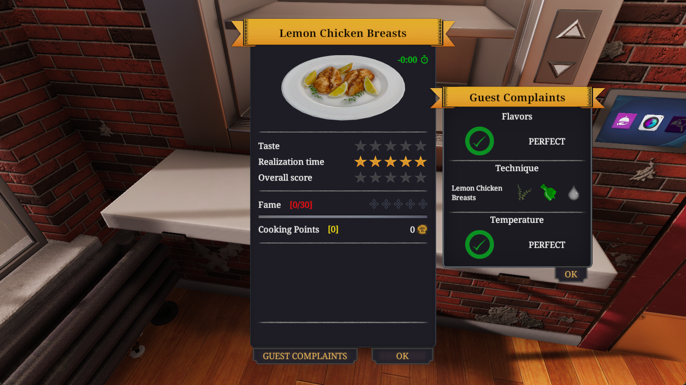

# CookBench: Embodied Cooking Agents in Cooking Simulator

Reference implementation and experiment harness for **CookBench**, a benchmark for
long-horizon embodied cooking agents. The agent observes a live *Cooking Simulator*
session, plans with an LLM/VLM, and acts through a semantic action + skill layer.

This repository is released for **double-blind review**; author and institution
information is intentionally omitted.

> **Third-party template assets.** `data/figure/` contains small icon crops taken
> from *Cooking Simulator* and used for template matching. They are included so the
> perception and GUI layers are runnable out of the box, and remain the property of
> the game's rights holders. See [Template assets](#template-assets).

## Layout

```text
.
  pyproject.toml          # package metadata (src layout)
  README.md
  configs/                # experiment configuration (JSON)
    common.json           # base config, extended by the pipeline configs
    pipelines/*.json      # one config per baseline mechanism
    cookbench_game_lock.json
    docs/config_desc.md   # config field reference and CLI override syntax
  data/                   # knowledge base (recipes, items, tools, nav map, icons)
    figure/               # in-game template crops (third-party; see below)
  docs/                   # environment setup notes and screenshots
    game_environment_lock.md
    images/               # screenshots referenced by this README
  memory/                 # prompt assets and documented-memory templates
  mods/                   # game-side bridge: MelonLoader mod + mapping tables
  scripts/                # CLI entry points
  src/epm/                # importable package
    brain/                # planner, prompt building, pipelines, modules
    cerebellum/           # action API, GUI flows, skills
    core/                 # agent loop, config loading, ablation control
    kb/                   # recipe access
    memory_store/         # documented memory (STM window, long-horizon history)
    vision/               # screen capture, template matching
    world_adapter/        # environment observation
```

## Prerequisites

| Requirement | Notes |
| --- | --- |
| Python >= 3.9 | 3.10 recommended |
| *Cooking Simulator* | Steam App ID `641320`; base game **and the Food Network DLC** |
| MelonLoader 0.5.7 | injects the game-side bridge that exports live state |
| Windows | the harness uses `mss` + `pygetwindow` for capture and OS-level input |

Install the game outside the system drive if possible, and keep the game window on
the primary monitor with **display scaling set to 100%** — scaling other than 100%
shifts screenshot coordinates and breaks template matching.

## 1. Install the game-side bridge

The harness reads the game's live state through a MelonLoader mod. Without it, the
perception layer has nothing to observe.

**1.1 Install MelonLoader 0.5.7.** Download the `.exe` installer from
<https://melonloader.co/download.html> (a copy is vendored at
[`mods/MelonLoader.Installer.exe`](mods/MelonLoader.Installer.exe)). Run it, select
the MelonLoader version and the game, and accept the defaults.

**1.2 Deploy the bridge mod.** The mod binary is **not redistributed here** (it is a
compiled artifact of a private game build). Obtain it separately, then place it in:

```text
<game-dir>/Mods/
```

**1.3 Deploy the mapping tables.** Copy both files into the game's `UserData`
directory:

```text
<game-dir>/UserData/object_en_ch_mapping.txt
<game-dir>/UserData/item_name_mapping.txt
```

Both are provided under [`mods/`](mods/) and are replaced wholesale when the mod is
updated.

**1.4 Verify.** Start the game and press the two hotkeys:

| Key | Effect |
| --- | --- |
| <kbd>F12</kbd> | Toggle live object tracking. Pick up an object and move it — the colour marker should follow. |
| <kbd>F10</kbd> | Toggle the visual UI overlay. Keep this **off** during experiments so it does not occlude the frame. |

If UI text appears, the bridge is working.


A successful evaluation run ends on the results screen below, where the dish name and
score are shown:



## 2. Configure the game

Enter a stable, repeatable kitchen scene:

```text
New game  →  Sandbox Mode  →  Classic
```

Then apply the environment settings shown below (graphics, resolution, and input):


Keep the window visible and unminimised: the harness re-activates it each step so
OS-level input stays focused.

## 3. Install the Python package

```powershell
cd <path-to-this-repo>
python -m venv .venv
.\.venv\Scripts\activate
pip install -U pip
pip install -e .
```

Or with conda:

```powershell
conda create -n cookbench python=3.10
conda activate cookbench
pip install -e .
```

Optional extras: `pip install -e ".[fast]"` (SciPy, speeds up template matching),
`.[viz]` (matplotlib, live navigation visualisation), `.[win32]` (pywin32, optional
annotation capture tool).

> **conda in the VS Code terminal.** If PowerShell refuses to load `profile.ps1`
> (`PSSecurityException` / `UnauthorizedAccess`), run:
>
> ```powershell
> conda init powershell
> $env:Path += ";<miniconda>;<miniconda>\Scripts;<miniconda>\condabin"
> Set-ExecutionPolicy -Scope CurrentUser -ExecutionPolicy RemoteSigned -Force
> ```


## 4. Configure the harness

Configuration is plain JSON. A pipeline config uses `"extends"` to inherit from
`configs/common.json`; relative paths resolve against the file that declares them.
`configs/docs/config_desc.md` lists every field and the `--key value` /
`--runtime.key value` CLI override forms.

**4.1 Point the harness at your game data.** Set `paths.game_userdata_root` in
`configs/common.json` (shared by every method):

```json
{ "paths": { "game_userdata_root": "<game-dir>/UserData" } }
```

The live-state files (`realtime_products.json`, `realtime_radar_scan.txt`,
`realtime_camera_info.txt`, `realtime_interaction_status.txt`) are derived from this
root. You can also set it without editing files, via the environment variable
`COOKGAME_USERDATA_ROOT`.


**4.2 Configure a model provider.** `configs/common.json` ships with neutral
`template_openai_compatible`, `template_anthropic_messages`, and `local` provider
stubs. Copy the template, fill in your own endpoint, and select it in
`api_model_assignments`:

```powershell
copy configs\api_keys.local.example.json configs\api_keys.local.json
```

Prefer environment variables (`api_key_env` / `api_key_pool_env`) over inline keys.
Because `api_keys.local.json` is git-ignored, `git pull` never overwrites it.


**4.3 Add local overrides (optional).** `configs/common.local.json` holds your own
changes and is likewise git-ignored. Create it yourself from the template:

```powershell
copy configs\common.local.example.json configs\common.local.json
```

The loader reads `common.json` first, then `common.local.json` over it.


> **Never commit real credentials.** `configs/*.local.json`, `.env`, and `runs/` are
> git-ignored. Verify with `git status --porcelain` before pushing.

### Email notifications (optional)

For long unattended batch runs, the harness can email on completion. Configure the
recipients in `configs/common.local.json`, then pass the mailbox authorization code
through an environment variable — **never** put it in a config file:

```powershell
setx EPM_EMAIL_PASS "<your-mailbox-auth-code>"
# reopen the shell, then verify:
echo $env:EPM_EMAIL_PASS
```


`configs/common.json` already points `notify_email_password_env` at
`EPM_EMAIL_PASS`; the SMTP host, port and TLS flag are set there too. Delivery is
handled by `src/epm/core/notifier.py`.

## 5. Running an episode

```powershell
# run until the environment reports completion, or up to a step cap
python scripts/run_episode.py --config configs/pipelines/planner_executor.json --dish-id 1 --max-steps 200

# live dashboard view
python scripts/run_episode_dashboard.py --config configs/pipelines/planner_executor.json --dish-id 1
```

Global emergency stop hotkey: `Ctrl+Alt+Q`.

Recipe IDs come from `data/classics1.json`, a list of objects with
`id` / `dish_name` / `ingredients` / `recipe`:

```bash
python -c "import json; d=json.load(open('data/classics1.json',encoding='utf-8')); print([(x['id'],x['dish_name']) for x in d[:20]])"
```

### Resume and rewind

```powershell
# continue the most recent run
python scripts/run_episode_dashboard.py --config configs/pipelines/planner_executor.json --dish-id 1 --resume --refresh-memory

# rewind to an absolute step
python scripts/run_episode_dashboard.py --config configs/pipelines/react.json --resume --run-name 20260413_xxx --resume-step-id 80

# rewind N steps from the current resume point
python scripts/run_episode_dashboard.py --config configs/pipelines/react.json --resume --run-name 20260413_xxx --rollback-steps 5
```

### Batch runs

```powershell
python scripts/run_episode_dashboard.py --config configs/pipelines/reflexion.json --dish-range 1-20,41-60 --auto-chain
```

**How `--auto-chain` interacts with `--resume`.** For:

```text
--config configs/pipelines/planner_executor.json --dish-range 40,41,83,88 --resume --refresh-memory --auto-chain
```

- `--dish-range 40,41,83,88` — the batch sequence, in written order
- `--resume` — continue the **most recent run**, not necessarily dish 40
- `--refresh-memory` — refresh memory state on resume
- `--auto-chain` — after the current dish succeeds, advance to the next in sequence

The script parses the range into `40 → 41 → 83 → 88`, then finds the latest run
under `runs/` and derives its dish id from the folder name. It then **trims the
sequence** to start there:

| Latest run resolves to | Effective sequence |
| --- | --- |
| 40 | `40 → 41 → 83 → 88` |
| 41 | `41 → 83 → 88` |

So the command means "resume the dish of the most recent run, restricted to this
batch, then continue through the rest of the batch" — it is **not** unconditionally
"start at 40".

### Restarting the environment

Only valid while the evaluation screen is open:

```powershell
python scripts/run_episode_dashboard.py --config configs/pipelines/planner_executor.json --dish-id 102 --restart-env
```

### Overriding config values inline

Append `--key value` to any command; nest with dots:

```powershell
python scripts/run_episode_dashboard.py --config configs/pipelines/planner_executor.json --dish-id 1 --runtime.force_submit_step_threshold 300
```

`force_submit_step_threshold` forces submission of the most recently interacted
container once that step is reached, which is how a score is obtained.

### Outputs

Each run writes to `runs/<timestamp>-<pipeline>-<dish_id>/`:

| Path | Contents |
| --- | --- |
| `memory/task_progress.txt` | task progress / milestones (optional atomic plan) |
| `memory/stm_window.txt` | short-term memory window (rolling) |
| `memory/long_horizon_history.txt` | full per-step record (JSONL) |
| `memory/prompt_last.txt` | last step's prompt (useful for debugging) |
| `memory/effective_prompt_ablation.json` | resolved ablation profile for the run |
| `screenshots/step_*.png` | per-step screenshots |

`runs/` is git-ignored.


> **Check the evaluation file before closing the evaluation screen.** Confirm the
> dish name is correct. If the wrong container was submitted, submit again manually.
> If the right container was submitted but the record was not written, the run must
> be repeated.
>
> The score and textual feedback live in the `recipe_feedback` file; `complaints`
> breaks down `flavors`, `technique`, `temperature` and `unwantedProducts`.


## Baselines

`brain.pipeline` selects the control-flow mechanism. All baselines share the same
environment, action API, and memory store, so only the Brain changes.

| `brain.pipeline` | Config | Mechanism |
| --- | --- | --- |
| `planner_executor` | `pipelines/planner_executor.json` | rolling-horizon plan-and-execute; stops and replans on failure |
| `open_loop` | `pipelines/open_loop.json` | plan once, execute all steps even after a failure |
| `react` | `pipelines/react.json` | ReAct, one action/skill per step |
| `reflexion` | `pipelines/reflexion.json` | ReAct + Reflexion, reflections written back to memory |
| `epm` (alias `epm_agent`) | `pipelines/epm.json` | **ours** — rolling planner + precondition gating + semantic task-progress maintenance |
| `cap` | `pipelines/cap.json` | Code-as-Policies: generate a constrained Python policy that yields actions |

Related switches: `brain.perception_mode` (`oracle` / `vlm` / `none`),
`brain.planner_mode` (`scripted` / `llm` / `vlm`), and `brain.plan_steps`
(rolling-horizon plan length).

## Main experiment: prompt ablation

The main experiment has eight ablated profiles plus a raw-control baseline, selected
by the single `--ablation-reduce` argument:

```powershell
python scripts/run_episode_dashboard.py `
  --config configs/pipelines/cap.json `
  --dish-range 23,26,27,29,34,35,40,47,52,58,65,73,74,84,98,101,111,112,125,137 `
  --auto-chain --ablation-reduce no_action
```

| Label | Prompt group removed |
| --- | --- |
| `no_body` | Body rules, including common-sense interaction constraints |
| `no_perception_sup` | Oracle object list, placement occupancy, tool interaction locations |
| `no_strategy` | Static planning strategy and experience notes |
| `no_history` | Short-term window, task progress, resume state, cached cross-step queries |
| `no_feedback` | Last-action execution feedback and precondition feedback |
| `no_rgb` | RGB screenshots are not attached to any model request |
| `no_skill` | All high-level skills; semantic action APIs remain |
| `no_action` | Semantic action APIs and skills; replaced by nine raw control primitives |

Omitting the argument runs `full`. `prompt_layout.json` controls rendering order
only. Each run records its resolved profile in
`memory/effective_prompt_ablation.json`.

## Documented memory

Planning and execution state are recorded separately and aligned via `plan_ref`, so
planned steps can be compared against what actually executed:

- task progress (todo list + atomic plan) → `memory/task_progress.txt`
- execution (short window + full JSONL) → `memory/stm_window.txt`, `memory/long_horizon_history.txt`

`memory/` holds shared templates and stable artifacts — `tools_manifest_openai.json`,
`agent_state.template.json`, `body_rules.txt`, `strategy_notes.txt`, the
`prompt_layout.json` assembly template, and per-module prompt assets under
`memory/epm/`. See [`memory/README.md`](memory/README.md).

## Skills

Skills live under `src/epm/cerebellum/skills/`: `auto_navigation/`, `auto_cutting/`,
`auto_pouring/`, `auto_sprinkling/`, `auto_flipping/`, `auto_mix/`,
`auto_perception/`, plus query skills (`query_scene_objects`,
`query_product_catalog`, `query_tool_manual`, `query_tool_en`,
`list_supported_items`).

## Notes and tips

- **Networking.** Pull dependencies with a proxy enabled if needed, but **disable it
  while running experiments** (or route the model API domains directly) — an
  intercepting proxy interferes with API calls.
- **Updating.** After pulling new code, re-run `pip install -e .`:

  ```powershell
  git fetch origin
  git pull --ff-only
  pip install -e .
  ```

- **Saving scenes.** Interesting or resumable scenes can be captured with
  `save game` and restored with `load game`.


## Reproducing the environment

Exact game/depot versions used for the experiments, and the procedure for
reconstructing that environment, are in
[`docs/game_environment_lock.md`](docs/game_environment_lock.md).
`scripts/manage_game_environment.py` automates depot download / import / verify.

## Template assets

The perception layer and several GUI flows match the screen against small reference
icons cropped from the game (item icons, store buttons, checkout UI, etc.). They are
bundled under `data/figure/` so the harness runs out of the box:

```text
data/figure/
  computer/                 # game UI buttons and panels (submit, order, perks, ...)
  computer/order/           # dish thumbnails for the order menu
  store/                    # store shelves and product icons
  object-icon/              # per-item icons used for matching
  object-icon-transparent/  # alpha-free variants for overlay matching
```

These crops are third-party assets belonging to the game's rights holders, included
solely so the perception and GUI layers are runnable for research and review. If you
redistribute this repository, review whether you are permitted to pass them on, or
delete `data/figure/` and regenerate the crops from your own installation.

**Regenerating the crops.** Capture the game at the resolution used in
`configs/common.json`, then cut the UI regions documented in
`src/epm/cerebellum/gui_actions/` and `src/epm/cerebellum/figure_path_mappings.py`
(which lists every expected filename). Drop the results into the layout above and
the template-matching paths work unchanged; adjust `figure_path_mappings.py` if you
prefer to store them elsewhere. Hand-captured screenshots (`PixPin_*.png`,
`Screenshot_*.png`) are git-ignored by design.

> Navigation-map revisions and point-cloud exports older than the one referenced by
> `configs/common.json` are not shipped, since only the referenced map is read at
> run time.

The harness drives the game through standard OS input and screen-capture APIs. It
ships no game code and contacts no network endpoint other than the model providers
you configure.

## License

Released under the MIT License — see [`LICENSE`](LICENSE).
